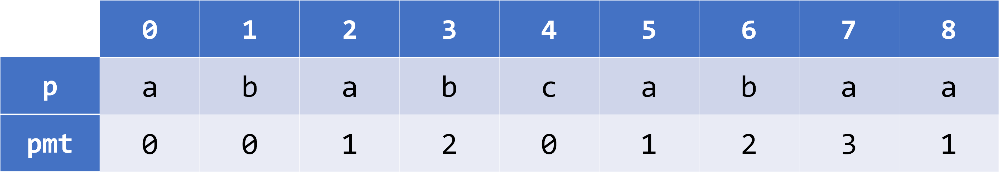
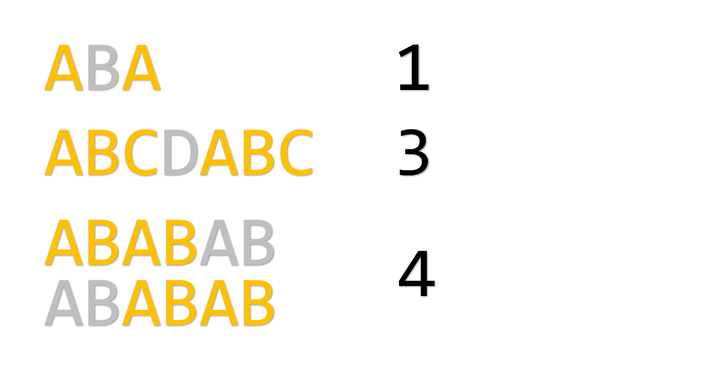

# KMP算法

文本串**s**中快速查找模式串**p**的一种算法

## 1. **PMT数组** (部分匹配表)
``pmt[i]``就是，从``p[0]``往后数、同时从``p[i]``往前数相同的位数，在保证前后缀相同的情况下，最多能数多少位


##### 获取PMT数组
就是自己匹配自己
```cpp
void get_pmt(string s)
{
    //pmt[0]=0
    for (int i = 1, j = 0; i < s.length(); ++i)
    {
        while (j && s[i] != s[j])
            j = pmt[j - 1];
        if (s[i] == s[j])
            j++;
        pmt[i] = j;
    } 
}
```
##### KMP
```cpp
void kmp(string s,string p)
{
    for (int i = 0, j = 0; i < s.length(); i++)
    {
        while (j && s[i] != p[i])// 不断前移j指针，直到成功匹配或移到头为止
            j = pmt[j - 1];// 当前位匹配成功，j指针右移
        if (s[i] == p[j])
            j++;
        if (j == p.length())//完全匹配成功
        {
            // 输出下标
            // 因为要1-index，所以是+2
            cout << i - j + 2 << endl;
            j = pmt[j - 1];
        }
    }
}
```
## 2. **next数组**
next数组就是PMT整体右移一位(next[0]=-1)

